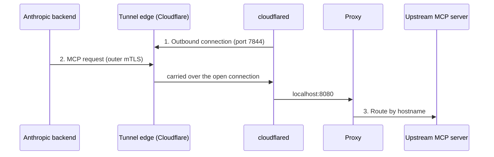

<!-- source: https://platform.claude.com/docs/en/agents-and-tools/mcp-tunnels/concepts / last verified: 2026-08-07 -->

# Architecture and components

Canonical terminology for MCP tunnel deployments: components, the two credential-provisioning modes, and the connection model.

## Signature / Usage

## Options / Props

| Term | Definition | Also appears as |
| --- | --- | --- |
| Tunnel stack | The proxy + cloudflared containers (+ setup component with programmatic access) | the stack, the MCP tunnel stack |
| Proxy | Anthropic's routing component; terminates inner TLS, validates upstream IPs, routes by hostname | `mcp-proxy`, `mcp-gateway` |
| cloudflared | Cloudflare's outbound tunnel connector | the outbound connector |
| Setup component | `setup` binary inside `mcp-proxy` image; provisions credentials via WIF | setup Job/service/hook/binary/CLI |
| Tunnel edge | Cloudflare edge servers (`198.41.192.0/19`, `2606:4700:a0::/44`, port 7844) | the edge |
| Inner TLS | Second TLS handshake inside the tunnel's WebSocket stream, terminating at the proxy | the inner TLS handshake |
| Upstream MCP server | An MCP server in your network, exposed as one subdomain | upstream, routed MCP server |

| Provisioning mode | How credentials arrive | Helm chart name |
| --- | --- | --- |
| Programmatic access | Setup component authenticates via Workload Identity Federation, generates/registers CA automatically | Managed mode (`setup.enabled: true`) |
| Manual | You copy the tunnel token and register a self-generated CA by hand | External mode (`setup.enabled: false`) |

## Notes

- Connection direction (cloudflared dials outbound) and request direction (MCP requests flow Anthropic → your network) point opposite ways; "outbound-only" describes the connection, not the requests.
- cloudflared and the tunnel edge see only ciphertext; the proxy is the first point inside your network where MCP payloads are readable.
- This terminology page underlies the Claude API's MCP-tunnel transport, distinct from Claude Code's MCP configuration (`anthropic-claude-code-extend`).

## Related

- [overview.md](./overview.md)
- [reference.md](./reference.md)
