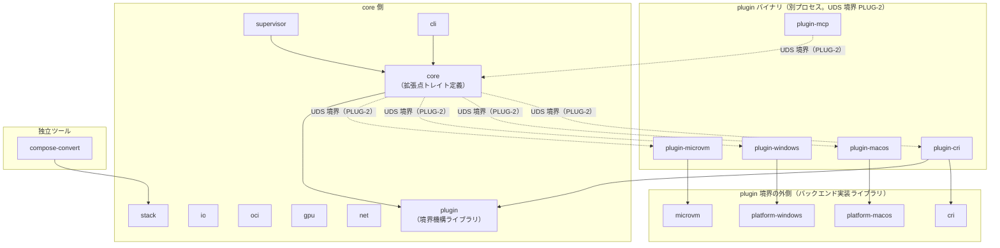
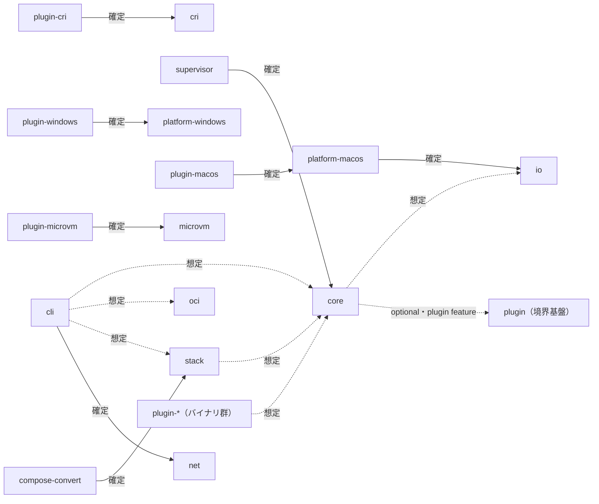

# アーキテクチャ

crate 境界・依存方向・実装コードを持たない確定済み設計判断への索引となる文書（REPAIR-3）。個々の crate の責務・PLUG-1 区分の確定一覧は [crate-naming.md](design/crate-naming.md) を正とし、本書ではそれを層構造・依存方向の観点で要約する。

- 作成日: 2026-09-27
- 関連 issue: #21（TASK-6）・#22（TASK-6.1・本書）・#23（TASK-6.2）・#24（TASK-6.h1）・#30（TASK-72）
- ステータス: #24（TASK-6.h1）で内容レビュー承認待ち
- 対象ビヘイビア: REPAIR-3・PLUG-1（crate 分割の前提として REPAIR-1 も参照）・WIN-6
- 対象マイルストーン: MS-0

spec（`docs/spec/04-behavior/`）と本書の記述が食い違う場合は spec を正とする（[spec-reference](../.claude/rules/spec-reference.md)）。

## crate 境界

workspace は次の層に分けられる。

1. **境界基盤**: `plugin`（`fandhe-container-plugin`）。plugin 境界機構（UDS・長さ接頭辞フレーム・gRPC）を提供し、core 側・plugin 側の双方から依存される
2. **I/O 共有層**: `io`。バッチ write-back・フラッシュバリア・FS 正規化を提供する
3. **実行層**: `core`。namespace・cgroups v2・seccomp/Landlock・rootless・拡張点トレイト（`ContainerRuntime`・`StateStore`・`NetworkPlugin`・`VolumeProvider`）を持つ
4. **実行層を使う core 側 crate**: `supervisor`（コンテナごとの監視プロセス）・`oci`（イメージ管理）・`gpu`（CDI）・`net`（netlink/nftables）・`stack`（TOML スキーマ）
5. **入口**: `cli`（統一 CLI）。独立ツールとして `compose-convert`（`compose.yaml` → TOML 変換）が別枠である
6. **plugin 境界の外側（バックエンド実装ライブラリ）**: `cri`・`platform-macos`・`platform-windows`・`microvm`。PLUG-1 上は「core」ではなく、対応する plugin バイナリから呼ばれる実装本体
7. **plugin バイナリ（別プロセス）**: `plugin-cri`・`plugin-macos`・`plugin-windows`・`plugin-microvm`・`plugin-mcp`。UDS 境界（PLUG-2）を越えて 6. の実装ライブラリを動かす

`benches`（`fandhe-container-benches`）は上記いずれの層にも属さない、crate をまたぐベンチ回帰専用の `publish = false` workspace メンバーである（crate-naming.md 決定 7）。

### crate 一覧の要約表

短縮名・crate 名・PLUG-1 区分の確定一覧は [crate-naming.md](design/crate-naming.md) の表を参照する（本書での重複転記はしない）。層との対応のみ以下に示す。

| 層 | crate（短縮名） |
| ---- | ---- |
| 境界基盤 | plugin |
| I/O 共有層 | io |
| 実行層 | core |
| 実行層を使う core 側 | supervisor・oci・gpu・net・stack |
| 入口 | cli |
| 独立ツール | compose-convert |
| plugin 境界の外側（バックエンド実装） | cri・platform-macos・platform-windows・microvm |
| plugin バイナリ | plugin-cri・plugin-macos・plugin-windows・plugin-microvm・plugin-mcp |
| ベンチ専用 | benches |

### crate 境界図



実線は「設計上の依存方向」（Cargo 依存関係。現状の `Cargo.toml` にはまだ実装されていない辺を含む。「依存関係グラフ」節を参照）を示し、点線は「UDS 境界（PLUG-2）」ラベルを付した、UDS 境界を越える呼び出し関係のみを示す。`core --> plugin_lib`・`plugin_cri --> plugin_lib`（境界基盤ライブラリへの依存。crate-naming.md 表 #10「core・plugin 双方が依存する境界基盤ライブラリ」）は UDS 呼び出しではなく Cargo 依存関係のため実線で描く。plugin 境界の外側（バックエンド実装ライブラリ）は plugin バイナリからのみ呼ばれ、core 側からは直接依存しない。 `plugin` feature を除外した core のビルドとサイズ記録は [plugin-feature-size-record](design/plugin-feature-size-record.md)（PLUG-3・TASK-111.2）を参照。

## インターフェース契約（拡張点トレイト）

TASK-4（CRI-7）で定義した 4 つの拡張点トレイトは、いずれも定義ファイルが `crates/core/src/traits/` にある。シグネチャの二重管理を避けるため、詳細は各ファイルの rustdoc を参照する（本書では複製しない）。

| トレイト | 定義ファイル | 実装の置き場所（PLUG-1） |
| -------- | ------------ | ------------------------ |
| `ContainerRuntime` | `crates/core/src/traits/container_runtime.rs` | plugin 側（別プロセス＋UDS。`fandhe-container-plugin-cri` 等） |
| `NetworkPlugin` | `crates/core/src/traits/network_plugin.rs` | plugin 側（別プロセス＋UDS） |
| `StateStore` | `crates/core/src/traits/state_store.rs` | core に既定実装（ファイルベース）。別実装は plugin で差し替え可能 |
| `VolumeProvider` | `crates/core/src/traits/volume_provider.rs` | core 側（定義・実装とも。データパス直結のため plugin 境界を持たない。D-14） |

共通型（`ContainerId`・`ErrorCode`・`TraitError` 等）は `crates/core/src/traits/types.rs` に置く。

plugin 境界のワイヤー形式（別プロセス＋長さ接頭辞フレーム、ペイロード serde_json、wire 互換が要る場面のみ gRPC）は PLUG-2 として ID のみ参照する。詳細な実装は TASK-107 系（`plugin` crate 本体）で行う。

## 依存関係グラフ

### 現状（Cargo.toml の実測）

workspace 内 crate 間の依存辺は、実装が進んだ TASK から順に `Cargo.toml` へ追加されている（例: `cli` → `net`、`platform-macos` → `io`）。網羅的な一覧は下記の確認コマンドで取得する。

確認コマンド:

```bash
cargo metadata --format-version 1 --no-deps | jq '[.packages[] | {name, deps: [.dependencies[].name]}]'
```

依存は各 TASK の実装が進むにつれて追加される。追加時は「設計上の依存方向」の表を更新する。

### 設計上の依存方向

以下は各 TASK・crate-naming.md の決定に基づく設計上の依存方向であり、現状の `Cargo.toml` には未反映の辺を含む。各辺には「確定（出典）」「想定（未確定・該当 TASK で確定）」「未確定（方向を決めない）」のいずれかのラベルを付ける。



| 依存元 → 依存先 | 根拠 | 状態 |
| ---------------- | ---- | ---- |
| `compose-convert` → `stack` | crate-naming.md 決定 5（TOML の型は `stack` のものを使う） | 確定 |
| `supervisor` → `core` | crate-naming.md 決定 6（`StateStore` 既定実装を core に一本化。supervisor は 2 つ目の実装を持たない） | 確定 |
| `plugin-cri` → `cri` | crate-naming.md 表 #15（`cri` の実装を別プロセス化。TASK-114） | 確定 |
| `plugin-macos` → `platform-macos` | crate-naming.md 表 #16（TASK-115） | 確定 |
| `plugin-windows` → `platform-windows` | crate-naming.md 表 #17（TASK-116） | 確定 |
| `plugin-microvm` → `microvm` | crate-naming.md 表 #18（TASK-117） | 確定 |
| `plugin`（境界基盤） | crate-naming.md 表 #10（core 側・plugin 側双方が依存する境界基盤） | 確定（依存の向きは双方向的な基盤利用であり、上記フローチャートでは個別の辺として描かない） |
| `core` → `io` | `VolumeProvider`（core 実装）がデータパスで I/O 共有層を使う想定（D-14。G2/G3 で確定） | 想定 |
| `cli` → `core` | 統一 CLI が実行層を呼ぶ想定（G6・TASK-79） | 想定 |
| `cli` → `oci` | 統一 CLI がイメージ管理を呼ぶ想定（G6・TASK-79） | 想定 |
| `platform-macos` → `io` | virtiofs 共有の I/O 共有プロトコルクライアント（`PipelineClient`）を使う（MAC-1・TASK-65.2。workspace 内 path 依存で実装済み。外部クレートの追加ではない）。向きはバックエンド → core 側で、規則 2 の逆向きのため抵触しない | 確定 |
| `cli` → `net` | `doctor` が br_netfilter・ホストの `ip filter FORWARD` policy の判定材料を net の読み取り照会（GETCHAIN）で取得する（NET-10・TASK-148.1。workspace 内 path 依存で実装済み。組み合わせ判定・警告・DOCKER-USER 案内・終了コードの評価層は TASK-148.2 で実装済み。CLI 配線は TASK-79） | 確定 |
| `cli` → `stack` | 統一 CLI が TOML スキーマを呼ぶ想定（G6・TASK-155） | 想定 |
| `plugin-*`（バイナリ群） → `core` | トレイト型（`ContainerRuntime` 等の共通型）を参照する想定（TASK-114〜118） | 想定 |
| `core` → `plugin`（境界基盤） | core の `plugin` feature（既定で有効）で optional 依存。`--no-default-features` で除外できる（PLUG-3・TASK-111.1・#262）。plugin 候補の探索は core 側の `crates/core/src/plugin_discovery.rs` に実装済み。登録の成果物も core 側に置く想定（TASK-109） | 確定（optional 辺。探索は実装済み・登録は未実装） |
| `stack` → `core` | `up` コマンドが core の CLI／ライブラリ API を呼ぶ想定（PLUG-1 境界表の stack 行・TASK-155） | 想定 |
| `net` を含む辺 | PLUG-1 区分が「検討中」（NET-5・NET-9 のデータパス判定未確定。`plugin-system.md`） | 未確定 |
| `gpu` の GPU-1〜4 以外を含む辺 | GPU-5・7・8 は境界表に明示判定なし、GPU-9 は「検討中」（`api-gpu.md`） | 未確定 |
| macOS Venus（GPU-6）関連の辺 | 成果物は `plugin-macos` 側に置く定義のみが確定しており、依存の詳細な方向は未確定 | 未確定 |

### 一方向依存の規則

1. 循環依存を作らない
2. core 側 crate（`io`・`core`・`supervisor`・`oci`・`gpu`・`net`・`stack`・`cli`）は `plugin-*` バイナリ crate・バックエンド実装ライブラリ（`cri`・`platform-macos`・`platform-windows`・`microvm`）に依存しない
3. 複数 crate が共有する型は下位 crate（`core`）に置く
4. plugin の追加で core を変更しない（PLUG-4）。機械判定（core ソース sha256・`cargo tree -p <core> --locked -e normal`・core バイナリ sha256。crate-naming.md 決定 3）は TASK-109 で実装予定であり、本書・本 PR ではスクリプトを追加しない

## core / plugin 境界（PLUG-1）

D-14（方針追記 2）に基づく core / plugin の割り付け表を以下に転記する（PLUG-1）。出典は `docs/spec/04-behavior/plugin-system.md`「境界表」であり、記述が食い違う場合は spec を正とする。crate 単位の PLUG-1 区分は [crate-naming.md](design/crate-naming.md) を正とし、本節では重複させない。

| 対象 | 配置 | 根拠 |
| ---- | ---- | ---- |
| Linux ネイティブ実行層（`api-runtime-core.md`）・I/O 共有プロトコル（`api-io-share.md`）・OCI イメージ（`api-oci-image.md`）・CLI（`screen-cli.md`） | core | D-14 の core 範囲定義そのもの |
| `ContainerRuntime`（`api-cri.md` CRI-7） | plugin（トレイト定義は core、実装を別プロセスへ配置可能） | 制御面のみを扱い、Δp50=5.542μs（長さ接頭辞フレーム）で CORE-10/MAC-2 目標に無視できる影響（PoC-13。フレーム方式の値は bincode ペイロードでの計測値であり、serde_json 変更に伴い TASK-113 で再計測する） |
| `StateStore`（同上） | **core**（トレイト定義・ファイルベースの既定実装とも core。別実装〔分散ストア等〕は plugin として差し替え可能） | 既定実装は core、別実装は plugin で差し替え可能。CLI・supervisor・`create`/`delete` の全経路が使う状態ファイル（OCI-5）であり、plugin 未導入の最小構成でも状態管理を完結させ、常駐デーモンを持たない CORE-1 と整合させるため（ユーザー決定 2026-09-26）。別実装を plugin に出す場合のオーバーヘッドは制御面として許容範囲（PoC-13） |
| `NetworkPlugin`（同上） | plugin（同上） | 制御面（ネットワーク設定操作）でありデータパス（パケット転送そのもの）ではないため同様に許容範囲（PoC-13） |
| `VolumeProvider`（同上） | **core**（トレイト定義・実装とも core に残す） | データパス（ファイル I/O）に接するため。gRPC 境界で PoC-2 batch 比 17.62%、フレーム境界でも 3.71% の劣化が数値で示された（PoC-13 データパス机上見積もり） |
| macOS バックエンド（`api-platform-macos.md`） | plugin（別プロセス、常駐/都度起動いずれも可） | MAC-2 上乗せが常駐 5.032ms（core-harness 起動＋UDS 接続＋4 RPC〔代表操作 A・B〕を含む保守的な値）・都度起動 2.537ms（いずれも 2 秒目標の 0.3%未満、PoC-13） |
| Windows バックエンド（`api-platform-windows.md`） | plugin（macOS と同型の境界を想定） | 上記と同様の制御面境界コストの見込み。実測は macOS 単独のため参考値（PoC-13、Linux/Windows での再確認は Phase 5 へ申し送り） |
| microVM（`api-microvm.md`） | plugin（起動・停止等の制御面のみ。VM 内部の I/O パスは対象外） | 制御面操作である限り上記と同様（PoC-13） |
| CRI サーバー（`api-cri.md`） | plugin | 制御面（`RunPodSandbox` 等）であり PoC-13 の代表操作 (A) そのもの |
| MCP サーバー（`api-mcp.md`） | plugin（`fandhe-container-plugin-mcp` として参照実装済み） | core 無変更で追加可能なことを実証（PoC-13 成功基準 3） |
| CDI の適用・OCI hook の実行（`api-gpu.md` GPU-1〜GPU-4） | core（推奨） | GPU の device node・mount・env 付与は汎用の mount／device 操作であり D-14 の core 範囲定義（Linux ネイティブ実行層）と整合する。hook はホスト権限でコンテナの rootfs を書き換える（ld キャッシュ更新等）ため、core 内で OCI hook（`createContainer` 相当）を実行する機能として実装する案を推奨する（D-15、gpu-passthrough-cdi〔PoC-14〕）。未解決疑問点 11 は未決であり、core 範囲の最終確定はスコープ確認（Phase 4→5）以降に持ち越す |
| DNS ヘルパー・rootless ネットワーク転送（`api-network.md` NET-5・NET-9） | 検討中（未確定） | ネットワークごとの DNS ヘルパーとユーザー空間転送（pasta 相当）はデータパス上で動作するプロセスである。core⇔plugin の IPC 往復がデータパスに入るわけではなく、転送プロセス自体がネットワークを構成するという点で `VolumeProvider`（データパスのため core 固定）とは性質が異なる（D-18）。この整理を D-14 の原則（plugin 境界をデータパスに置かない）の例外として認めるかは未確定であり、判断材料（性質の違い・実測されたセットアップ時間への影響なし）のみを記録する |
| supervisor（コンテナごとの監視プロセス、`api-supervisor.md`、D-19） | core | コンテナのライフサイクルに従属する軽量監視プロセスであり、CORE-1 の「中央の常駐デーモンを持たない」への読み替え（D-19）の実装主体そのものである。PLUG-2 の plugin 境界を経由せず実行層コアの一部として動作する（supervisor-model、PoC-17。own n=0 で常駐プロセス 0 個を実機確認） |
| 複数コンテナ定義の `up`／`down` 等（`api-stack.md`） | 独立した plugin 境界を持たない | `up` は TOML（STACK-1）を解析し、`depends_on` のトポロジカルソート順に core の CLI／ライブラリ API を順に呼ぶオーケストレーションで、別プロセス plugin 境界を持たない（`api-supervisor.md` SUP-1 の監視プロセス起動 API 等。supervisor-model、PoC-17 の `supervisor up` 実装で確認） |

転記元: `docs/spec/04-behavior/plugin-system.md`（submodule リビジョン `2241961`）の境界表。追加分 3（2026-09-23）の 4 行（CDI の適用・OCI hook の実行／DNS ヘルパー・rootless ネットワーク転送／supervisor／複数コンテナ定義の `up`／`down`）を含む。

補足:

- CDI の適用・OCI hook の実行（行）は `core（推奨）` の段階であり、未解決疑問点 11 が未決のため確定扱いしない
- DNS ヘルパー・rootless ネットワーク転送（行）は `検討中（未確定）` であり、D-14 原則の例外とするかは未確定である
- GPU-5・7・8・9 は境界表に明示判定がない（[crate-naming.md](design/crate-naming.md) 注 1 を参照）

## Windows ネイティブコンテナ・Hyper-V 直接方式の MVP スコープ（WIN-6）

MVP における Windows 対応の主経路は WSL2 経由（WIN-1）である。その上で、以下の 2 方式については MVP スコープを次のとおり判断する。

- **Windows ネイティブコンテナ**（Windows Server ベースイメージ専用のコンテナ実行）は、本プロジェクトの主目的である「OCI 準拠 Linux コンテナ実行基盤」とは別カテゴリの技術であり、**MVP の射程外**とする
- **Hyper-V 直接方式**（WHP〔Windows Hypervisor Platform〕API 経由で VMM をフルスクラッチ実装する経路）は、将来の強い分離オプションとして**設計上は残すが MVP には実装しない**。これは microVM の 3 OS 展開方針（`api-microvm.md` MVM-5。本書「確定済み設計判断」節を参照）で Windows（WHP）を将来オプションと位置づけているのと同系統の扱いである。ただし、この方式を実装する場合の crate 配置（`microvm` 系統に含めるか等）は [crate-naming.md](design/crate-naming.md) に現時点で明示判定がなく、MVM-5 の本書追記を担う TASK-78 側で確定する事項であり、本節では断定しない

根拠は PoC-4 の机上検証であり、実機性能計測ではない点に注意する（`README.md` 記載の PoC 位置づけと同様）。

出典: `docs/spec/04-behavior/api-platform-windows.md`（submodule リビジョン `2241961`）の `WIN-6`。

## 確定済み設計判断（実装コードを持たないもの）

| ID | 要約 | spec 出典 | 本リポ側の詳細 |
| -- | ---- | --------- | --------------- |
| CRI-8 | オーケストレーション本体（スケジューラ・マルチノード調整）は MVP 対象外とし、4 つの拡張点トレイトの設計のみを MVP に含める | `api-cri.md` | [orchestration-scope.md](design/orchestration-scope.md)（TASK-5・#20） |
| WIN-6 | Windows ネイティブコンテナは MVP の射程外。Hyper-V 直接方式は将来の強分離オプションとして設計上残す | `api-platform-windows.md` | 本書「Windows ネイティブコンテナ・Hyper-V 直接方式の MVP スコープ（WIN-6）」節を参照 |
| MAC-4 | 既定は常駐 VM＋軽量プロセス分離とし、1 コンテナ = 1 VM はオプション扱いとする | `api-platform-macos.md` | `docs/design/macos-vm-strategy.md`（TASK-66 で作成予定） |
| MVM-5 | microVM の 3 OS 展開は Linux（KVM）→ macOS（Hypervisor.framework）の順で進め、Windows（WHP）は将来オプションとする | `api-microvm.md` | 本書へ TASK-78 で追記予定 |
| REPAIR-11 | モデル規模で自己補修の可否を一律禁止せず、ハーネス（REPAIR-7・REPAIR-12）を通過した変更のみ採用する | `ai-self-repair.md` | [small-model-repair-policy.md](design/small-model-repair-policy.md)（TASK-92。当該メモ自体は #44〔TASK-92.h1〕で再承認待ち） |
| REPAIR-1 | 19 crate＋`benches` の workspace 構成（crate 分割の前提として本書冒頭の「crate 境界」節が参照する） | `ai-self-repair.md` | [crate-naming.md](design/crate-naming.md)（TASK-1.h1・#9） |
| CORE-4 | MVP のリソース制限は cgroups v2 単独対応とし、cgroups v1（hybrid 含む）・systemd cgroup driver には対応しない | `api-runtime-core.md` | [cgroups.md](design/cgroups.md)（TASK-34・#166） |

## 見直し

REPAIR-3・PLUG-1、または [crate-naming.md](design/crate-naming.md) が更新されたら本書も追従する。`plugin-system.md` の境界表が更新されたら「core / plugin 境界（PLUG-1）」節も追従する。`api-platform-windows.md` の `WIN-6` が更新されたら「Windows ネイティブコンテナ・Hyper-V 直接方式の MVP スコープ（WIN-6）」節も追従する。依存を追加した際は「依存関係グラフ」節の「現状」を更新する。
