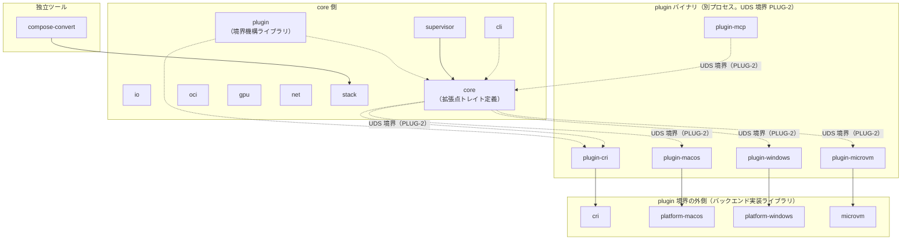
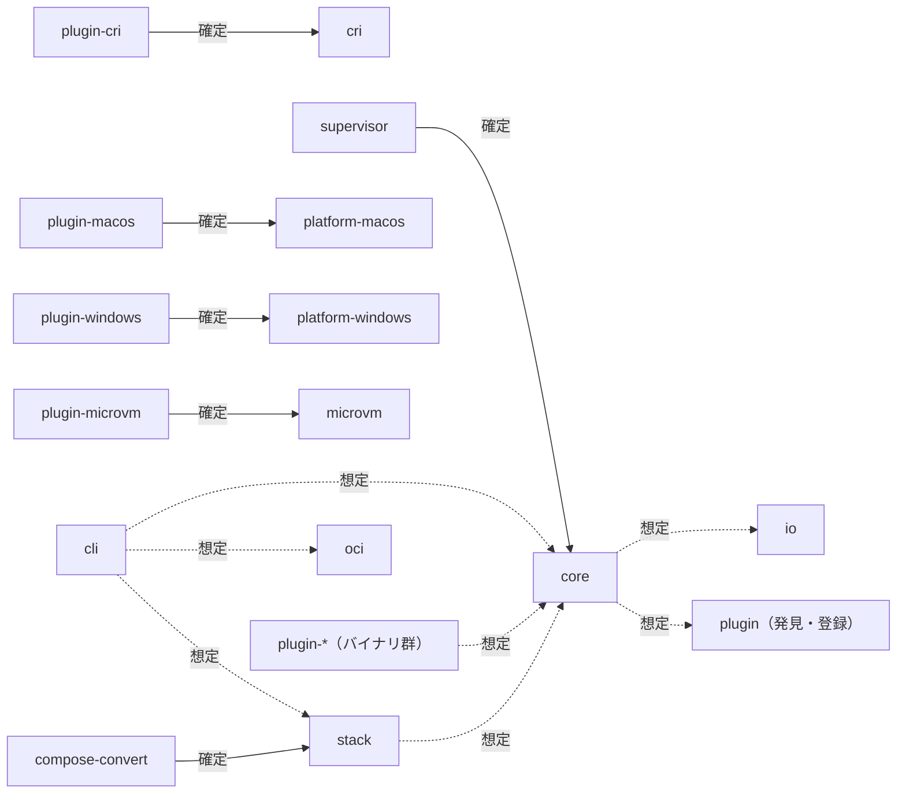

# アーキテクチャ

crate 境界・依存方向・実装コードを持たない確定済み設計判断への索引となる文書（REPAIR-3）。個々の crate の責務・PLUG-1 区分の確定一覧は [crate-naming.md](design/crate-naming.md) を正とし、本書ではそれを層構造・依存方向の観点で要約する。

- 作成日: 2026-09-27
- 関連 issue: #21（TASK-6）・#22（TASK-6.1・本書）・#23（TASK-6.2）・#24（TASK-6.h1）
- ステータス: #24（TASK-6.h1）で内容レビュー承認待ち
- 対象ビヘイビア: REPAIR-3・PLUG-1（crate 分割の前提として REPAIR-1 も参照）
- 対象マイルストーン: MS-0

spec（`docs/spec/04-behavior/`）と本書の記述が食い違う場合は spec を正とする（[spec-reference](../.claude/rules/spec-reference.md)）。

## crate 境界

workspace は次の層に分けられる。

1. **境界基盤**: `plugin`（`fandhe-container-plugin`）。plugin 境界機構（UDS・長さ接頭辞フレーム・gRPC）を提供し、core 側・plugin 側の双方から依存される
2. **I/O 共有層**: `io`。バッチ write-back・フラッシュバリア・FS 正規化を提供する
3. **実行層**: `core`。namespace・cgroups v2・seccomp/Landlock・rootless・拡張点トレイト（`ContainerRuntime`・`StateStore`・`NetworkPlugin`・`VolumeProvider`）を持つ
4. **実行層を使う core 側 crate**: `supervisor`（コンテナごとの監視プロセス）・`oci`（イメージ管理）・`gpu`（CDI）・`net`（netlink/nftables）・`stack`（TOML スキーマ）
5. **入口**: `cli`（統一 CLI）。独立ツールとして `compose-convert`（`compose.yaml` → TOML 変換）が別枠である
6. **plugin 境界の外側（バックエンド実装ライブラリ）**: `cri`・`platform-macos`・`platform-windows`・`microvm`。PLUG-1 上は「core」ではなく、対応する plugin バイナリから呼ばれる実装本体
7. **plugin バイナリ（別プロセス）**: `plugin-cri`・`plugin-macos`・`plugin-windows`・`plugin-microvm`・`plugin-mcp`。UDS 境界（PLUG-2）を越えて 6. の実装ライブラリを動かす

`benches`（`fandhe-container-benches`）は上記いずれの層にも属さない、crate をまたぐベンチ回帰専用の `publish = false` workspace メンバーである（crate-naming.md 決定 7）。

### crate 一覧の要約表

短縮名・crate 名・PLUG-1 区分の確定一覧は [crate-naming.md](design/crate-naming.md) の表を参照する（本書での重複転記はしない）。層との対応のみ以下に示す。

| 層 | crate（短縮名） |
| ---- | ---- |
| 境界基盤 | plugin |
| I/O 共有層 | io |
| 実行層 | core |
| 実行層を使う core 側 | supervisor・oci・gpu・net・stack |
| 入口 | cli |
| 独立ツール | compose-convert |
| plugin 境界の外側（バックエンド実装） | cri・platform-macos・platform-windows・microvm |
| plugin バイナリ | plugin-cri・plugin-macos・plugin-windows・plugin-microvm・plugin-mcp |
| ベンチ専用 | benches |

### crate 境界図



実線は「設計上の依存方向」（現状の `Cargo.toml` にはまだ実装されていない辺を含む。「依存関係グラフ」節を参照）、点線は UDS 境界（PLUG-2）を越える呼び出し関係を示す。plugin 境界の外側（バックエンド実装ライブラリ）は plugin バイナリからのみ呼ばれ、core 側からは直接依存しない。

## インターフェース契約（拡張点トレイト）

TASK-4（CRI-7）で定義した 4 つの拡張点トレイトは、いずれも定義ファイルが `crates/core/src/traits/` にある。シグネチャの二重管理を避けるため、詳細は各ファイルの rustdoc を参照する（本書では複製しない）。

| トレイト | 定義ファイル | 実装の置き場所（PLUG-1） |
| -------- | ------------ | ------------------------ |
| `ContainerRuntime` | `crates/core/src/traits/container_runtime.rs` | plugin 側（別プロセス＋UDS。`fandhe-container-plugin-cri` 等） |
| `NetworkPlugin` | `crates/core/src/traits/network_plugin.rs` | plugin 側（別プロセス＋UDS） |
| `StateStore` | `crates/core/src/traits/state_store.rs` | core に既定実装（ファイルベース）。別実装は plugin で差し替え可能 |
| `VolumeProvider` | `crates/core/src/traits/volume_provider.rs` | core 側（定義・実装とも。データパス直結のため plugin 境界を持たない。D-14） |

共通型（`ContainerId`・`ErrorCode`・`TraitError` 等）は `crates/core/src/traits/types.rs` に置く。

plugin 境界のワイヤー形式（別プロセス＋長さ接頭辞フレーム、ペイロード serde_json、wire 互換が要る場面のみ gRPC）は PLUG-2 として ID のみ参照する。詳細な実装は TASK-107 系（`plugin` crate 本体）で行う。

## 依存関係グラフ

### 現状（Cargo.toml の実測）

2026-09-27 時点で、workspace 内 crate 間の依存辺は **0 件**である。19 crate＋`benches` はいずれも TASK-1.3 の雛形段階で、`[dependencies]` を持たない。確認コマンド:

```bash
cargo metadata --format-version 1 --no-deps | jq '[.packages[] | {name, deps: [.dependencies[].name]}]'
```

依存は各 TASK の実装が進むにつれて追加される。追加時は本節（「現状」）を更新する。

### 設計上の依存方向

以下は各 TASK・crate-naming.md の決定に基づく設計上の依存方向であり、現状の `Cargo.toml` には未反映の辺を含む。各辺には「確定（出典）」「想定（未確定・該当 TASK で確定）」「未確定（方向を決めない）」のいずれかのラベルを付ける。



| 依存元 → 依存先 | 根拠 | 状態 |
| ---------------- | ---- | ---- |
| `compose-convert` → `stack` | crate-naming.md 決定 5（TOML の型は `stack` のものを使う） | 確定 |
| `supervisor` → `core` | crate-naming.md 決定 6（`StateStore` 既定実装を core に一本化。supervisor は 2 つ目の実装を持たない） | 確定 |
| `plugin-cri` → `cri` | crate-naming.md 表 #15（`cri` の実装を別プロセス化。TASK-114） | 確定 |
| `plugin-macos` → `platform-macos` | crate-naming.md 表 #16（TASK-115） | 確定 |
| `plugin-windows` → `platform-windows` | crate-naming.md 表 #17（TASK-116） | 確定 |
| `plugin-microvm` → `microvm` | crate-naming.md 表 #18（TASK-117） | 確定 |
| `plugin`（境界基盤） | crate-naming.md 表 #10（core 側・plugin 側双方が依存する境界基盤） | 確定（依存の向きは双方向的な基盤利用であり、上記フローチャートでは個別の辺として描かない） |
| `core` → `io` | `VolumeProvider`（core 実装）がデータパスで I/O 共有層を使う想定（D-14。G2/G3 で確定） | 想定 |
| `cli` → `core` | 統一 CLI が実行層を呼ぶ想定（G6・TASK-79） | 想定 |
| `cli` → `oci` | 統一 CLI がイメージ管理を呼ぶ想定（G6・TASK-79） | 想定 |
| `cli` → `stack` | 統一 CLI が TOML スキーマを呼ぶ想定（G6・TASK-155） | 想定 |
| `plugin-*`（バイナリ群） → `core` | トレイト型（`ContainerRuntime` 等の共通型）を参照する想定（TASK-114〜118） | 想定 |
| `core` → `plugin`（発見・登録） | plugin 発見・登録の成果物が core 側（`crates/core/src/plugin_discovery.rs`）に置かれる想定（TASK-109） | 想定 |
| `stack` → `core` | `up` コマンドが core の CLI／ライブラリ API を呼ぶ想定（PLUG-1 境界表の stack 行・TASK-155） | 想定 |
| `net` を含む辺 | PLUG-1 区分が「検討中」（NET-5・NET-9 のデータパス判定未確定。`plugin-system.md`） | 未確定 |
| `gpu` の GPU-1〜4 以外を含む辺 | GPU-5・7・8 は境界表に明示判定なし、GPU-9 は「検討中」（`api-gpu.md`） | 未確定 |
| macOS Venus（GPU-6）関連の辺 | 成果物は `plugin-macos` 側に置く定義のみが確定しており、依存の詳細な方向は未確定 | 未確定 |

### 一方向依存の規則

1. 循環依存を作らない
2. core 側 crate（`io`・`core`・`supervisor`・`oci`・`gpu`・`net`・`stack`・`cli`）は `plugin-*` バイナリ crate・バックエンド実装ライブラリ（`cri`・`platform-macos`・`platform-windows`・`microvm`）に依存しない
3. 複数 crate が共有する型は下位 crate（`core`）に置く
4. plugin の追加で core を変更しない（PLUG-4）。機械判定（core ソース sha256・`cargo tree -p <core> --locked -e normal`・core バイナリ sha256。crate-naming.md 決定 3）は TASK-109 で実装予定であり、本書・本 PR ではスクリプトを追加しない

## core / plugin 境界（PLUG-1）

未記載。#23（TASK-6.2）で `docs/spec/04-behavior/plugin-system.md` の境界表を転記する。

## 確定済み設計判断（実装コードを持たないもの）

| ID | 要約 | spec 出典 | 本リポ側の詳細 |
| -- | ---- | --------- | --------------- |
| CRI-8 | オーケストレーション本体（スケジューラ・マルチノード調整）は MVP 対象外とし、4 つの拡張点トレイトの設計のみを MVP に含める | `api-cri.md` | [orchestration-scope.md](design/orchestration-scope.md)（TASK-5・#20） |
| WIN-6 | Windows ネイティブコンテナは MVP の射程外。Hyper-V 直接方式は将来の強分離オプションとして設計上残す | `api-platform-windows.md` | 本書へ TASK-72 で追記予定 |
| MAC-4 | 既定は常駐 VM＋軽量プロセス分離とし、1 コンテナ = 1 VM はオプション扱いとする | `api-platform-macos.md` | `docs/design/macos-vm-strategy.md`（TASK-66 で作成予定） |
| MVM-5 | microVM の 3 OS 展開は Linux（KVM）→ macOS（Hypervisor.framework）の順で進め、Windows（WHP）は将来オプションとする | `api-microvm.md` | 本書へ TASK-78 で追記予定 |
| REPAIR-11 | モデル規模で自己補修の可否を一律禁止せず、ハーネス（REPAIR-7・REPAIR-12）を通過した変更のみ採用する | `ai-self-repair.md` | [small-model-repair-policy.md](design/small-model-repair-policy.md)（TASK-92。当該メモ自体は #44〔TASK-92.h1〕で再承認待ち） |
| REPAIR-1 | 19 crate＋`benches` の workspace 構成（crate 分割の前提として本書冒頭の「crate 境界」節が参照する） | `ai-self-repair.md` | [crate-naming.md](design/crate-naming.md)（TASK-1.h1・#9） |

## 見直し

REPAIR-3・PLUG-1、または [crate-naming.md](design/crate-naming.md) が更新されたら本書も追従する。依存を追加した際は「依存関係グラフ」節の「現状」を更新する。
